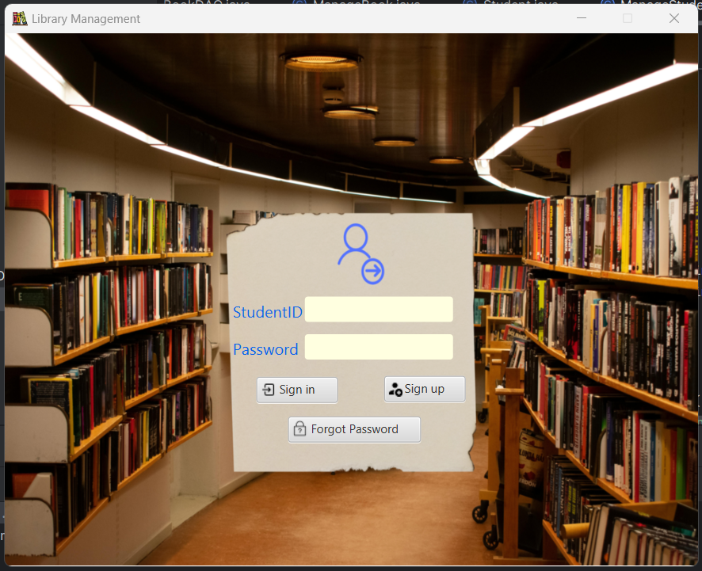
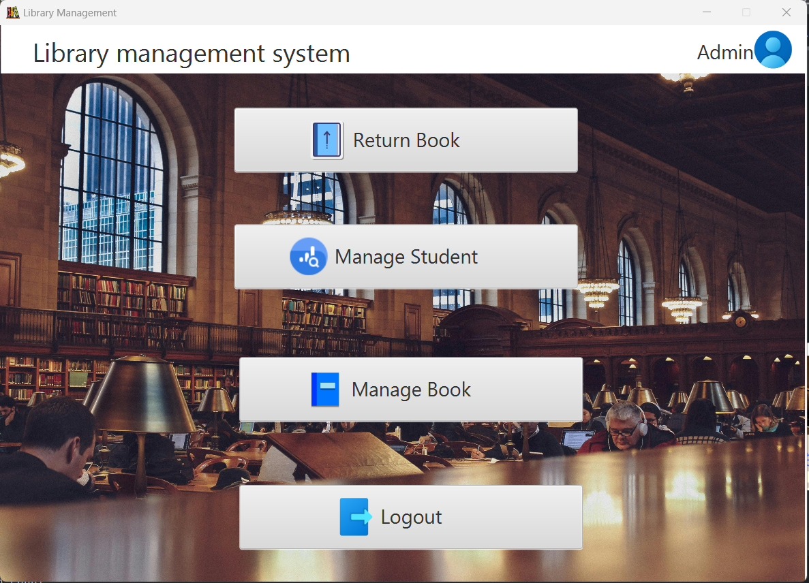
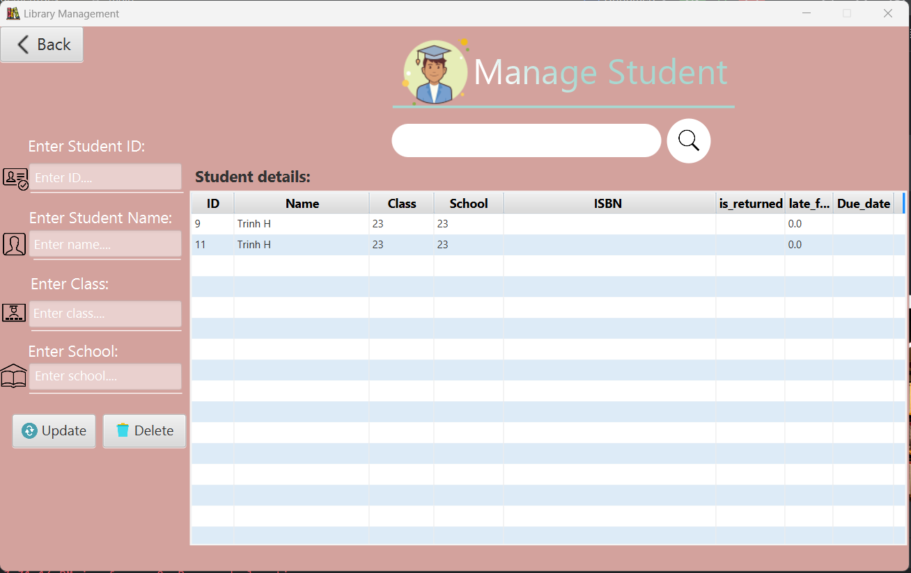
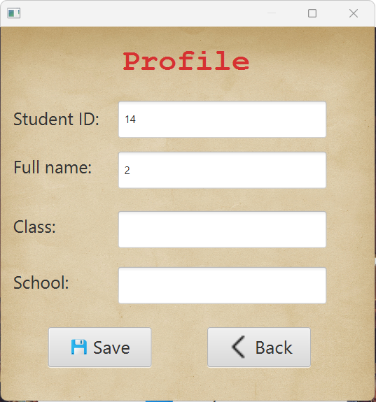
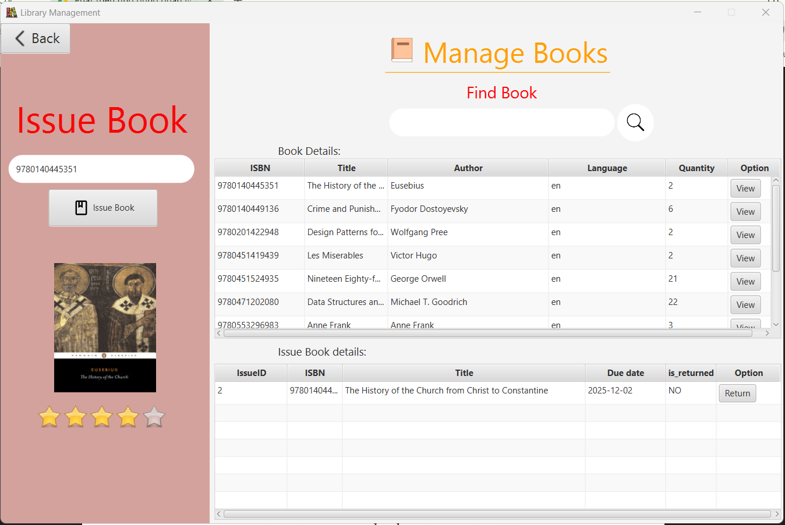
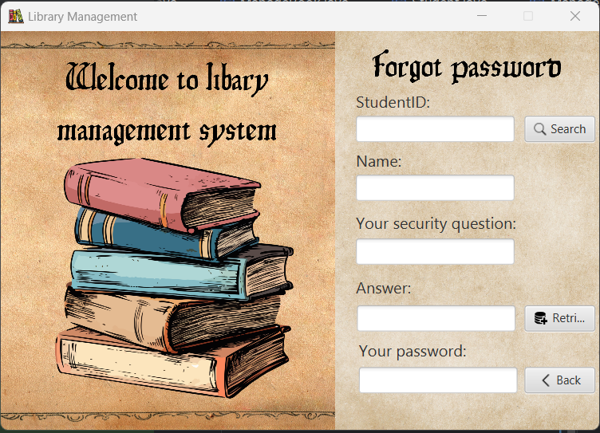
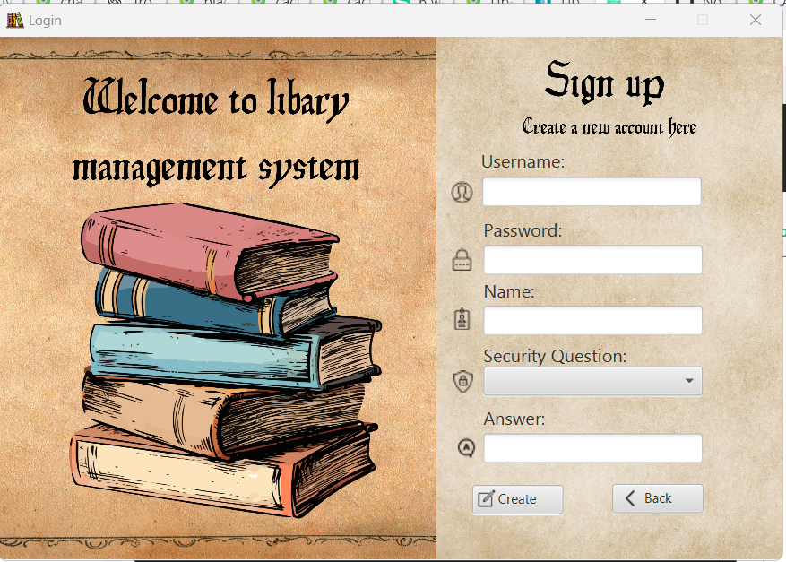

# Library Management System - BTL - INT2204 7

## Mô tả

## Sinh viên thực hiện
| Họ Tên | Msv   |
| :-------- | :------- | 
| Nguyễn Trung Kiên | 23021589 |
| Nguyễn Tiến Vũ | 23021752 |
| Trần Thị Phương Thảo | 23020157 |

## Chức năng:

- Quản lý tài liệu (Thêm, Xóa, Sửa, Tìm kiếm, Thông tin sách)
- Quản lý người dùng thư viện (mượn/trả tài liệu, thông
  tin thành viên, Xoá, Sửa, Tìm Kiếm).
- Chức năng tự sáng tạo (đánh giá nhận xét tài liệu).
- Xử lý các trường hợp lỗi.
- Giao diện người dùng.
- Tích hợp API tra cứu thông tin tài liệu.

## Công cụ và Công nghệ

- Java : Ngôn ngữ lập trình.
- JavaFX : Khung xây dựng giao diện người dùng đồ họa (GUI)
- SceneBuilder : Công cụ thiết kế giao diện JavaFX một cách trực quan.
- Google Books API : API được sử dụng để lấy dữ liệu sách.
- MySQL : Cơ sở dữ liệu lưu trữ thông tin.

## Cách sử dụng

Đăng nhập: nhập vào tên và mật khẩu.

Đối với người dùng là thủ thư

- Quản lí sinh viên: thủ thư có thể sửa, xoá, tìm kiếm thông tin sinh viên

- Quản lí sách: thủ thư nhập IBSN để check thông tin tài liệu, thủ thư có thể thêm, sửa, tìm kiếm, xoá sách.

Đối với người dùng là sinh viên

- Profile

- Quản lí sách: sinh viên có thể tìm kiếm sách, xem thông tin sách, mượn, trả và đánh giá sách.

Quên mật khẩu: người dùng có thể lấy lại mật khẩu bằng cách nhập id để tìm kiếm và trả lời đúng security answer.

Đăng kí: Nếu chưa có tài khoản, sinh viên có thể đăng kí tài khoản.

## Demo

Insert gif or link to demo

## Hướng dẫn cài đặt

- Để chạy project, mọi người mở phần mềm IntelliJ IDEA, mở thư mục LibraryManagement, sử dụng jdk23.0.1 và thêm thư viện sdk23.0.1, xóa VM option trước khi chạy.
- Nếu chạy bị lỗi, hãy kiểm tra lại các đường dẫn địa chỉ chỉ đến các file txt, fxml đã trùng khớp với code chưa.
- Chạy tệp DictionaryApplication trong package Dictionary để chạy chương trình.
